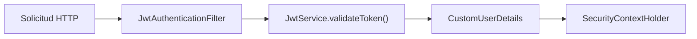
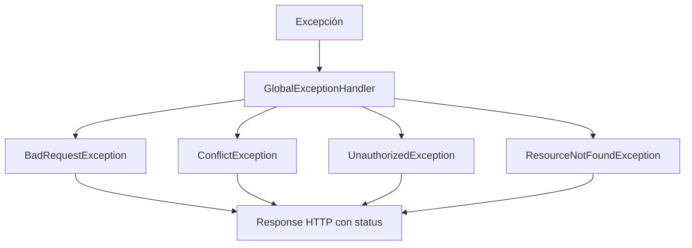
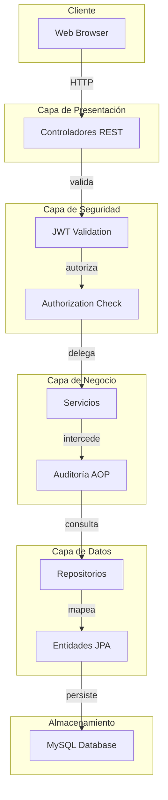

# Arquitectura del Backend

## Descripción General de la Arquitectura

El backend de Escritores implementa una **arquitectura de capas** (Layered Architecture) con separación clara de responsabilidades, siguiendo principios SOLID y patrones de diseño reconocidos.

## Capas de la Arquitectura

### 1. Capa de Presentación (Controllers)

Responsabilidades:
- Recibir solicitudes HTTP
- Validar parámetros de entrada
- Delegar al servicio correspondiente
- Devolver respuestas HTTP apropiadas

**Ubicación**: `controller/`  
**Patrones**: RESTful, anotaciones de Spring MVC

```java
@RestController
@RequestMapping("/stories")
public class StoryController {
    private final StoryService storyService;
    
    @GetMapping("/{id}")
    public StoryDetailResponse getStoryById(@PathVariable Integer id) {
        return storyService.getStoryById(id);
    }
}
```

### 2. Capa de Seguridad (Security)

Responsabilidades:
- Autenticación basada en JWT
- Autorización por roles
- Validación de tokens
- Gestión de sesiones

**Ubicación**: `security/`  
**Componentes Principales**:
- `JwtService`: Generación y validación de JWT
- `JwtAuthenticationFilter`: Filtro de autenticación
- `CustomUserDetails`: Detalles del usuario autenticado



### 3. Capa de Lógica de Negocio (Services)

Responsabilidades:
- Implementar reglas de negocio
- Orquestar operaciones con múltiples repositorios
- Validaciones complejas
- Transformación de datos

**Ubicación**: `service/`  
**Características**:
- Transaccionalidad automática con `@Transactional`
- Inyección de dependencias
- Métodos públicos documentados

```java
@Service
@RequiredArgsConstructor
public class StoryService {
    private final StoryRepository storyRepository;
    private final ChapterRepository chapterRepository;
    
    @Transactional
    public CreateStoryResponse createStory(CreateStoryRequest request) {
        // Lógica de negocio
    }
}
```

### 4. Capa de Auditoría (Audit Aspect)

Responsabilidades:
- Registrar cambios en entidades
- Capturar auditoría automática
- Seguimiento de usuario y fecha

**Ubicación**: `audit/`  
**Tecnología**: Spring AOP

```java
@Aspect
@Component
public class DatabaseAuditAspect {
    @Around("@annotation(Auditable)")
    public Object audit(ProceedingJoinPoint joinPoint) {
        // Registra cambios automáticamente
    }
}
```

### 5. Capa de Datos (Repositories)

Responsabilidades:
- Operaciones CRUD en base de datos
- Consultas JPA/Query derivadas
- Gestión de transacciones a nivel de base de datos

**Ubicación**: `repository/`  
**Tecnología**: Spring Data JPA, Hibernate

```java
@Repository
public interface StoryRepository extends JpaRepository<Story, Integer> {
    List<Story> findByOwnerUserIdAndPublicationStateOrderByCreatedAtDesc(
        Integer userId, String publicationState
    );
}
```

### 6. Capa de Entidades (Entities)

Responsabilidades:
- Mapeo objeto-relacional (ORM)
- Representación de datos del dominio
- Validaciones a nivel de entidad

**Ubicación**: `entity/`  
**Características**:
- Anotaciones JPA (`@Entity`, `@Column`, etc.)
- Soft delete implementado
- Auditoría automática de fechas

### 7. Capa de DTOs (Request/Response)

Responsabilidades:
- Transferencia de datos entre capas
- Validación de entrada
- Separación entre modelo interno y API

**Ubicación**: `dto/`  
**Patrón**: Separación Request/Response

```
dto/
├── request/        # Objetos de entrada (@Valid)
│   ├── CreateStoryRequest
│   └── UpdateStoryRequest
└── response/       # Objetos de salida
    ├── StoryDetailResponse
    └── CreateStoryResponse
```

### 8. Capa de Configuración (Config)

**Ubicación**: `config/`

**Componentes**:

| Componente | Propósito |
|---|---|
| `SecurityConfig` | Configuración de Spring Security |
| `CorsConfig` | Configuración de CORS |
| `OpenApiConfig` | Configuración de Swagger/OpenAPI |

## Flujo de Solicitud HTTP

```
1. Cliente envía solicitud HTTP
    ↓
2. CorsConfig valida origen
    ↓
3. SecurityConfig y JwtAuthenticationFilter validan token JWT
    ↓
4. Controlador recibe solicitud
    ↓
5. Validaciones de entrada (@Valid)
    ↓
6. Servicio procesa lógica de negocio
    ↓
7. DatabaseAuditAspect registra cambios (si aplica)
    ↓
8. Repositorio ejecuta operación de BD
    ↓
9. Respuesta se retorna al cliente
    ↓
10. GlobalExceptionHandler maneja errores si ocurren
```

## Manejo de Excepciones

**Ubicación**: `exception/`



**Tipos de Excepciones**:

| Excepción | Status HTTP | Caso de Uso |
|---|---|---|
| `BadRequestException` | 400 | Entrada inválida |
| `UnauthorizedException` | 401 | No autenticado |
| `ConflictException` | 409 | Conflicto de datos |
| `ResourceNotFoundException` | 404 | Recurso no encontrado |

## Patrones de Diseño Utilizados

### 1. Patrón Service Locator / Inyección de Dependencias

```java
@RequiredArgsConstructor  // Lombok genera constructor
public class StoryService {
    private final StoryRepository storyRepository;  // Inyectado
    private final ChapterRepository chapterRepository;
}
```

### 2. Patrón DTO (Data Transfer Object)

Separación entre modelo persistente y API:

```
Entity (JPA) → Service → DTO (Response) → Cliente
Cliente → DTO (Request) → Service → Entity (JPA)
```

### 3. Patrón Repository

Abstracción del acceso a datos:

```java
public interface StoryRepository extends JpaRepository<Story, Integer> {
    // Métodos derivados automáticamente
}
```

### 4. Patrón Aspect-Oriented Programming (AOP)

```java
@Aspect
public class DatabaseAuditAspect {
    @Around("@annotation(Auditable)")
    public Object audit(ProceedingJoinPoint joinPoint) { }
}
```

## Relaciones Entre Capas



## Componentes Transversales

### Spring Security

- **Configuración**: `SecurityConfig.java`
- **Responsabilidades**: Autenticación, autorización, gestión de sesiones
- **Flujo**: 
  1. Cliente incluye token JWT en header `Authorization: Bearer <token>`
  2. `JwtAuthenticationFilter` intercepta la solicitud
  3. `JwtService` valida el token
  4. `SecurityContextHolder` almacena el usuario autenticado
  5. Métodos `@PreAuthorize` verifican permisos

### AOP para Auditoría

- **Ubicación**: `audit/DatabaseAuditAspect.java`
- **Propósito**: Registrar automáticamente cambios en entidades
- **Mecanismo**: Intercepta métodos anotados con `@Auditable`

### Validación

- **Bean Validation**: Anotaciones como `@NotNull`, `@Size`, etc. en DTOs
- **Manejo**: `GlobalExceptionHandler` captura `MethodArgumentNotValidException`

## Ventajas de esta Arquitectura

1. **Separación de Responsabilidades**: Cada capa tiene un propósito claro
2. **Testabilidad**: Fácil de crear tests unitarios e integración
3. **Mantenibilidad**: Código organizado y comprensible
4. **Escalabilidad**: Fácil agregar nuevas funcionalidades
5. **Reutilización**: Servicios compartidos entre controladores
6. **Seguridad**: Validación en múltiples niveles

## Principios SOLID Aplicados

| Principio | Implementación |
|---|---|
| **S** (Single Responsibility) | Cada servicio tiene una responsabilidad única |
| **O** (Open/Closed) | Extensible mediante herencia y composición |
| **L** (Liskov Substitution) | Interfaces bien definidas (Repository, Service) |
| **I** (Interface Segregation) | Interfaces específicas y no bloated |
| **D** (Dependency Inversion) | Inyección de dependencias con Spring |

