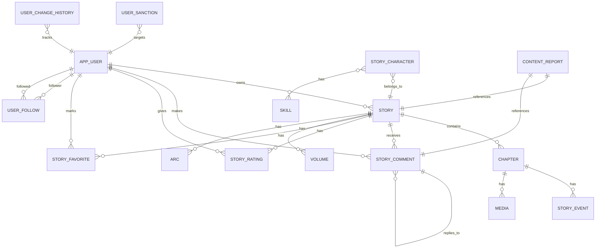

# Base de Datos

## Información de Conexión

### Detalles de Conexión

```properties
Base de datos: MySQL
Host: sg-rds-mysql.clx2xb6nogbs.us-east-1.rds.amazonaws.com
Puerto: 3306 (predeterminado)
Database: historias_db
Usuario: admin12
Contraseña: Nunclear55 (cambiar en producción)
Región AWS: us-east-1
```

> **Pendiente de completar según configuración real del proyecto**: Las credenciales actuales deben ser reemplazadas en producción con variables de entorno seguras.

### Cadena de Conexión JDBC

```
jdbc:mysql://sg-rds-mysql.clx2xb6nogbs.us-east-1.rds.amazonaws.com/historias_db?useSSL=false&serverTimezone=UTC&allowPublicKeyRetrieval=true
```

## Gestión de Esquema

### Configuración Hibernate

```properties
spring.jpa.hibernate.ddl-auto=update
```

| Opción | Comportamiento |
|---|---|
| `create` | Crea esquema, destruye datos al reiniciar |
| `create-drop` | Crea y limpia al cerrar |
| `update` | Actualiza esquema sin eliminar datos (desarrollo) |
| `validate` | Valida esquema, no modifica (recomendado producción) |
| `none` | No hace nada |

**Recomendación**: 
- Desarrollo: `update`
- Producción: `validate`
- Testing: `create-drop`

## Estructura de Tablas

### Entidades Principales

#### 1. `app_user`
Usuarios del sistema.

```sql
CREATE TABLE app_user (
    id INT PRIMARY KEY AUTO_INCREMENT,
    login_name VARCHAR(100) NOT NULL UNIQUE,
    email_address VARCHAR(255) NOT NULL UNIQUE,
    pending_email_address VARCHAR(255),
    email_change_requested_at DATETIME,
    password_hash VARCHAR(255) NOT NULL,
    access_level VARCHAR(30) NOT NULL,
    account_state VARCHAR(30) NOT NULL,
    display_name VARCHAR(150),
    bio_text TEXT,
    avatar_url VARCHAR(500),
    last_login_at DATETIME,
    email_verified_at DATETIME,
    created_at DATETIME,
    updated_at DATETIME,
    deleted_at DATETIME,
    deleted TINYINT(1) DEFAULT 0
);
```

#### 2. `story`
Historias principales.

```sql
CREATE TABLE story (
    id INT PRIMARY KEY AUTO_INCREMENT,
    owner_user_id INT NOT NULL,
    title VARCHAR(255) NOT NULL,
    slug_text VARCHAR(255) UNIQUE,
    description TEXT,
    cover_image_url VARCHAR(500),
    visibility_state VARCHAR(30) NOT NULL,
    publication_state VARCHAR(30) NOT NULL,
    allow_feedback BOOLEAN DEFAULT TRUE,
    allow_scores BOOLEAN DEFAULT TRUE,
    started_on DATE,
    published_at DATETIME,
    created_at DATETIME,
    updated_at DATETIME,
    archived_at DATETIME,
    deleted TINYINT(1) DEFAULT 0,
    deleted_at DATETIME,
    FOREIGN KEY (owner_user_id) REFERENCES app_user(id)
);
```

#### 3. `chapter`
Capítulos de historias.

```sql
CREATE TABLE chapter (
    id INT PRIMARY KEY AUTO_INCREMENT,
    story_id INT NOT NULL,
    volume_id INT,
    arc_id INT,
    title VARCHAR(255) NOT NULL,
    content_text TEXT,
    sequence_number INT,
    publication_state VARCHAR(30),
    published_at DATETIME,
    created_at DATETIME,
    updated_at DATETIME,
    deleted TINYINT(1) DEFAULT 0,
    deleted_at DATETIME,
    FOREIGN KEY (story_id) REFERENCES story(id),
    FOREIGN KEY (volume_id) REFERENCES volume(id),
    FOREIGN KEY (arc_id) REFERENCES arc(id)
);
```

#### 4. `story_comment`
Comentarios en historias.

```sql
CREATE TABLE story_comment (
    id INT PRIMARY KEY AUTO_INCREMENT,
    story_id INT NOT NULL,
    chapter_id INT,
    commenter_user_id INT NOT NULL,
    parent_comment_id INT,
    content_text TEXT NOT NULL,
    is_moderated BOOLEAN DEFAULT FALSE,
    created_at DATETIME,
    updated_at DATETIME,
    deleted TINYINT(1) DEFAULT 0,
    deleted_at DATETIME,
    FOREIGN KEY (story_id) REFERENCES story(id),
    FOREIGN KEY (chapter_id) REFERENCES chapter(id),
    FOREIGN KEY (commenter_user_id) REFERENCES app_user(id),
    FOREIGN KEY (parent_comment_id) REFERENCES story_comment(id)
);
```

#### 5. `story_rating`
Calificaciones de historias.

```sql
CREATE TABLE story_rating (
    id INT PRIMARY KEY AUTO_INCREMENT,
    story_id INT NOT NULL,
    rater_user_id INT NOT NULL,
    rating_value INT NOT NULL,
    created_at DATETIME,
    FOREIGN KEY (story_id) REFERENCES story(id),
    FOREIGN KEY (rater_user_id) REFERENCES app_user(id),
    UNIQUE(story_id, rater_user_id)
);
```

#### 6. `story_favorite`
Historias marcadas como favoritas.

```sql
CREATE TABLE story_favorite (
    id INT PRIMARY KEY AUTO_INCREMENT,
    story_id INT NOT NULL,
    user_id INT NOT NULL,
    created_at DATETIME,
    FOREIGN KEY (story_id) REFERENCES story(id),
    FOREIGN KEY (user_id) REFERENCES app_user(id),
    UNIQUE(story_id, user_id)
);
```

#### 7. `user_follow`
Seguimientos entre usuarios.

```sql
CREATE TABLE user_follow (
    id INT PRIMARY KEY AUTO_INCREMENT,
    follower_user_id INT NOT NULL,
    followed_user_id INT NOT NULL,
    created_at DATETIME,
    FOREIGN KEY (follower_user_id) REFERENCES app_user(id),
    FOREIGN KEY (followed_user_id) REFERENCES app_user(id),
    UNIQUE(follower_user_id, followed_user_id)
);
```

### Tablas de Seguridad

#### `user_session`
Sesiones activas de usuario.

```sql
CREATE TABLE user_session (
    id INT PRIMARY KEY AUTO_INCREMENT,
    user_id INT NOT NULL,
    session_identifier VARCHAR(255),
    refresh_token_hash VARCHAR(255),
    expires_at DATETIME,
    revoked_at DATETIME,
    ip_address VARCHAR(45),
    user_agent_text TEXT,
    created_at DATETIME,
    FOREIGN KEY (user_id) REFERENCES app_user(id)
);
```

#### `email_verification_token`
Tokens para verificar email.

```sql
CREATE TABLE email_verification_token (
    id INT PRIMARY KEY AUTO_INCREMENT,
    user_id INT NOT NULL,
    token_hash VARCHAR(255),
    expires_at DATETIME,
    verified_at DATETIME,
    created_at DATETIME,
    FOREIGN KEY (user_id) REFERENCES app_user(id)
);
```

#### `password_reset_token`
Tokens para reset de contraseña.

```sql
CREATE TABLE password_reset_token (
    id INT PRIMARY KEY AUTO_INCREMENT,
    user_id INT NOT NULL,
    token_hash VARCHAR(255),
    expires_at DATETIME,
    used_at DATETIME,
    created_at DATETIME,
    FOREIGN KEY (user_id) REFERENCES app_user(id)
);
```

### Tablas de Auditoría

#### `audit_log`
Registro de cambios en el sistema.

```sql
CREATE TABLE audit_log (
    id INT PRIMARY KEY AUTO_INCREMENT,
    user_id INT,
    entity_type VARCHAR(100),
    entity_id INT,
    action VARCHAR(50),
    changes JSON,
    created_at DATETIME,
    FOREIGN KEY (user_id) REFERENCES app_user(id)
);
```

## Relaciones Entre Entidades



## Soft Delete

El proyecto implementa **soft delete** para datos importantes:

```java
@SQLDelete(sql = "UPDATE story SET deleted = true, deleted_at = CURRENT_TIMESTAMP WHERE id = ?")
@SQLRestriction("deleted = false")
```

**Implicaciones**:
- Al eliminar, solo se marca `deleted = true` y se registra `deleted_at`
- Las consultas automáticamente filtran registros eliminados
- Los datos se conservan para auditoría

## Índices Recomendados

Para optimizar consultas:

```sql
-- Historias
CREATE INDEX idx_story_owner_user_id ON story(owner_user_id);
CREATE INDEX idx_story_slug_text ON story(slug_text);
CREATE INDEX idx_story_publication_state ON story(publication_state);

-- Capítulos
CREATE INDEX idx_chapter_story_id ON chapter(story_id);
CREATE INDEX idx_chapter_volume_id ON chapter(volume_id);

-- Comentarios
CREATE INDEX idx_story_comment_story_id ON story_comment(story_id);
CREATE INDEX idx_story_comment_commenter_user_id ON story_comment(commenter_user_id);

-- Usuarios
CREATE INDEX idx_app_user_login_name ON app_user(login_name);
CREATE INDEX idx_app_user_email_address ON app_user(email_address);

-- Sesiones
CREATE INDEX idx_user_session_user_id ON user_session(user_id);
CREATE INDEX idx_user_session_refresh_token_hash ON user_session(refresh_token_hash);
```

## Backup y Recovery

> **Pendiente de completar según configuración real del proyecto**: Definir estrategia de backup y recovery para producción.

**Recomendaciones**:
- Backups automáticos diarios (AWS RDS)
- Retención de backups: 30 días
- Testing periódico de recuperación
- Documentar procedimiento de restauración

## Monitoreo de Base de Datos

Verificar rendimiento con:

```sql
-- Tamaño de tablas
SELECT table_name, ROUND(((data_length + index_length) / 1024 / 1024), 2) AS size_mb
FROM information_schema.TABLES
WHERE table_schema = 'historias_db'
ORDER BY size_mb DESC;

-- Queries lentas
SHOW VARIABLES LIKE 'slow_query_log';
SHOW VARIABLES LIKE 'long_query_time';
```

## Migration Strategy

Para cambios de esquema en producción:

1. Crear script de migración
2. Probar en ambiente de staging
3. Ejecutar en horario de bajo tráfico
4. Tener plan de rollback

Usar herramientas como **Flyway** o **Liquibase** para versionamiento.

