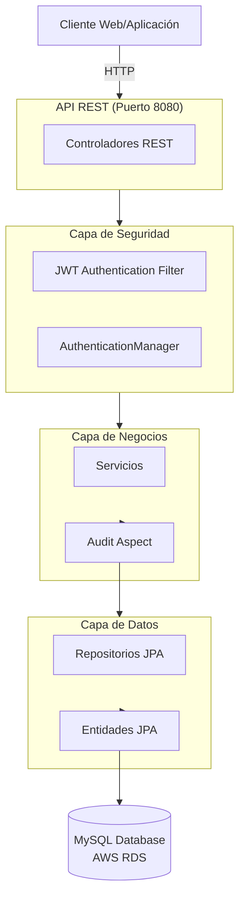

# Documentación Backend - Escritores

## Bienvenida

Esta documentación proporciona una guía completa del backend del sistema **Escritores**, una plataforma integral para la creación, gestión y visualización de historias digitales.

El backend está desarrollado con **Spring Boot 4.0.6** y utiliza una arquitectura de capas basada en controladores, servicios, repositorios y entidades JPA, proporcionando una API REST robusta y segura.

## Propósito del Backend

El backend de Escritores funciona como el motor central del sistema, responsable de:

- **Gestión de Usuarios**: Autenticación, autorización y administración de cuentas de usuario
- **Gestión de Historias**: Creación, edición, publicación y visualización de historias
- **Contenido Dinámico**: Capítulos, volúmenes, arcos, personajes, eventos, habilidades e ítems
- **Sistema de Comentarios y Calificaciones**: Retroalimentación de lectores sobre historias
- **Sistema de Favoritos y Seguimientos**: Gestión de preferencias de usuario
- **Auditoría y Seguridad**: Registro de cambios y control de sanciones de usuarios
- **Modulación de Contenido**: Reporte y revisión de contenido inapropiado
- **Análisis Métricos**: Seguimiento de vistas y engagement

## Tecnologías Principales

| Tecnología | Versión | Descripción |
|---|---|---|
| **Java** | 21 | Lenguaje base del proyecto |
| **Spring Boot** | 4.0.6 | Framework principal |
| **Spring Security** | Latest | Autenticación y autorización |
| **Spring Data JPA** | Latest | Acceso a datos con Hibernate |
| **JWT (JJWT)** | 0.12.3 | Tokens de autenticación |
| **MySQL** | Connector-J | Base de datos relacional |
| **Lombok** | Latest | Generación de código boilerplate |
| **JaCoCo** | 0.8.12 | Cobertura de pruebas |
| **SpringDoc OpenAPI** | 2.8.9 - 3.0.3 | Documentación API automática |
| **Maven** | 3+ | Gestor de dependencias |

## Arquitectura General



## Estructura de Carpetas

```
src/main/
├── java/com/nunclear/escritores/
│   ├── audit/                    # Aspectos de auditoría y logging
│   ├── config/                   # Configuraciones (Security, CORS, OpenAPI)
│   ├── controller/               # Controladores REST (15+ controladores)
│   ├── dto/
│   │   ├── request/              # DTOs de entrada
│   │   └── response/             # DTOs de salida
│   ├── entity/                   # Entidades JPA (26 entidades)
│   ├── enums/                    # Enumeraciones (AccessLevel, AccountState)
│   ├── exception/                # Excepciones personalizadas
│   ├── repository/               # Repositorios JPA (25+ repositorios)
│   ├── security/                 # Componentes de seguridad (JWT, CustomUserDetails)
│   ├── service/                  # Servicios de negocio (25+ servicios)
│   ├── util/                     # Utilidades
│   └── EscritoresApplication.java
└── resources/
    ├── application.properties     # Configuración de la aplicación
    └── (otros recursos)
```

## Información General

- **Total de Archivos Java**: ~310 archivos
- **Total de Directorios**: 17 directorios
- **Total de Entidades**: 26 entidades
- **Total de Servicios**: 25+ servicios
- **Total de Repositorios**: 25+ repositorios
- **Total de Controladores**: 15+ controladores

## Documentación por Sección

Para información detallada, consulte los siguientes documentos:

- **[Arquitectura](arquitectura.md)** - Descripción detallada de la arquitectura del sistema
- **[Estructura del Proyecto](estructura.md)** - Organización y estructura de carpetas
- **[Configuración](configuracion.md)** - Configuración de la aplicación
- **[Base de Datos](base-datos.md)** - Esquema y conexiones de base de datos
- **[Entidades](entidades.md)** - Documentación de todas las entidades JPA
- **[Repositorios](repositorios.md)** - Descripción de repositorios y consultas
- **[Servicios](servicios.md)** - Lógica de negocios y servicios
- **[Controladores](controladores.md)** - Endpoints y controladores REST
- **[Endpoints REST](endpoints.md)** - Documentación completa de la API
- **[Seguridad](seguridad.md)** - Autenticación, autorización y validaciones
- **[Pruebas](pruebas.md)** - Estrategia de testing
- **[Ejecución Local](ejecucion-local.md)** - Cómo ejecutar el proyecto en local
- **[Despliegue](despliegue.md)** - Cómo compilar y desplegar
- **[Errores Comunes](errores-comunes.md)** - Solución de problemas frecuentes

## Contacto y Soporte

Para consultas sobre este backend o la documentación, por favor contacte al equipo de desarrollo de Nunclear.

---

**Última actualización**: Julio 2026  
**Versión del Backend**: 0.0.1-SNAPSHOT  
**Estado**: En desarrollo
