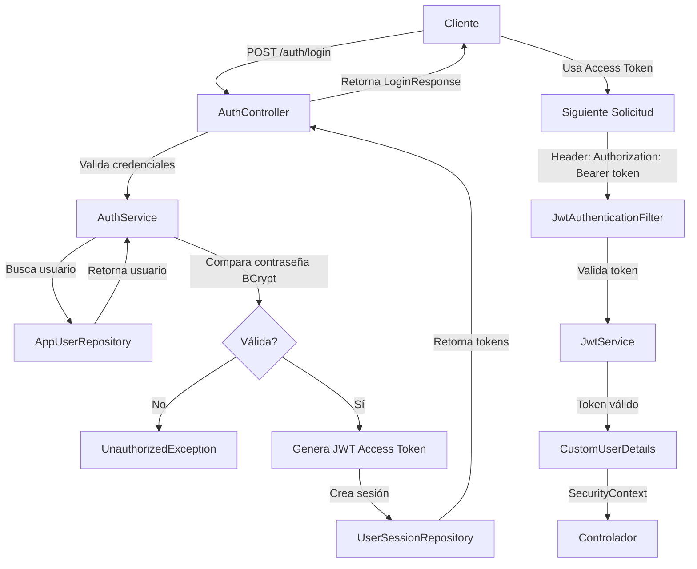

# Seguridad y Autenticación

## Visión General

El backend implementa un sistema robusto de seguridad basado en:
- **Autenticación JWT**: JSON Web Tokens para sesiones sin estado
- **Spring Security**: Framework de seguridad de Spring
- **BCrypt**: Codificación de contraseñas
- **Autorización por Roles**: Control de acceso basado en roles (RBAC)

## Autenticación

### Flujo de Autenticación



### Registro de Usuario

**Endpoint**: `POST /auth/register`

**Request**:
```json
{
    "loginName": "usuario123",
    "emailAddress": "usuario@ejemplo.com",
    "displayName": "Mi Nombre",
    "password": "ContraseñaSegura123!"
}
```

**Proceso**:
1. Validar que loginName y emailAddress sean únicos
2. Crear AppUser con estado `pending_verification`
3. Codificar contraseña con BCrypt
4. Generar token de verificación de email
5. Enviar email con token (en desarrollo se imprime en logs)

**Response**:
```json
{
    "id": 1,
    "loginName": "usuario123",
    "emailAddress": "usuario@ejemplo.com",
    "displayName": "Mi Nombre",
    "accessLevel": "user",
    "accountState": "pending_verification",
    "createdAt": "2026-07-07T10:30:00"
}
```

### Login

**Endpoint**: `POST /auth/login`

**Request**:
```json
{
    "loginOrEmail": "usuario123",
    "password": "ContraseñaSegura123!"
}
```

**Validaciones**:
- Usuario existe
- Usuario no está eliminado
- Cuenta no está suspendida o baneada
- Contraseña es correcta (BCrypt)

**Response**:
```json
{
    "accessToken": "eyJhbGc...",
    "refreshToken": "550e8400...",
    "tokenType": "Bearer",
    "expiresIn": 3600,
    "user": {
        "id": 1,
        "loginName": "usuario123",
        "displayName": "Mi Nombre",
        "accessLevel": "user"
    }
}
```

### JWT Token

**Generación**:
```java
String accessToken = jwtService.generateAccessToken(
    userId,
    loginName,
    accessLevel,
    sessionId
);
```

**Estructura JWT**:
- **Header**: Algoritmo (HS256), tipo (JWT)
- **Payload**: 
  - `sub`: ID del usuario
  - `username`: loginName
  - `role`: accessLevel
  - `sessionId`: ID único de sesión
  - `iat`: Fecha de emisión
  - `exp`: Fecha de expiración
- **Signature**: Firmado con clave secreta

**Duración**:
- Access Token: 3600 segundos (1 hora)
- Refresh Token: 604800 segundos (7 días)

### Refresh Token

**Endpoint**: `POST /auth/refresh`

**Request**:
```json
{
    "refreshToken": "550e8400..."
}
```

**Proceso**:
1. Validar que refresh token existe y no está revocado
2. Validar que no haya expirado
3. Crear nueva sesión
4. Generar nuevo access token
5. Revocar sesión anterior

## Autorización

### Spring Security Configuration

```java
@Configuration
@EnableMethodSecurity
public class SecurityConfig {
    
    @Bean
    public SecurityFilterChain securityFilterChain(HttpSecurity http) {
        http
            .csrf(AbstractHttpConfigurer::disable)    // Deshabilita CSRF
            .cors(Customizer.withDefaults())           // Habilita CORS
            .sessionManagement(sm -> 
                sm.sessionCreationPolicy(SessionCreationPolicy.STATELESS)  // Sin estado
            )
            .authorizeHttpRequests(auth -> auth
                .requestMatchers("/auth/**").permitAll()               // Público
                .requestMatchers("/dashboard/**").authenticated()      // Autenticado
                .requestMatchers("/admin/**").hasRole("ADMIN")         // Admin
                .anyRequest().authenticated()
            )
            .addFilterBefore(jwtAuthenticationFilter, UsernamePasswordAuthenticationFilter.class);
        
        return http.build();
    }
}
```

### Roles y Permisos

#### Roles Disponibles

| Rol | Descripción | Permisos |
|---|---|---|
| **USER** | Usuario normal | Crear historias, comentar, calificar |
| **MODERATOR** | Moderador | Revisar reportes, moderar contenido |
| **ADMIN** | Administrador | Acceso completo, gestionar usuarios |

#### Anotaciones de Autorización

```java
// Requiere autenticación
@PreAuthorize("isAuthenticated()")
public void metodo() { }

// Requiere rol USER o ADMIN
@PreAuthorize("hasAnyRole('USER','ADMIN')")
public void crearHistoria() { }

// Requiere rol ADMIN
@PreAuthorize("hasRole('ADMIN')")
public void dashboardAdmin() { }

// Expresión compleja
@PreAuthorize("hasRole('USER') and #userId == authentication.principal.userId")
public void miHistoria(@PathVariable Integer userId) { }
```

## Validaciones

### Validación de Entrada (DTOs)

Utilizamos Bean Validation con anotaciones:

```java
public record CreateStoryRequest(
    @NotBlank(message = "El título no puede estar vacío")
    @Size(min = 3, max = 255, message = "Título entre 3 y 255 caracteres")
    String title,
    
    @Size(max = 5000, message = "Descripción máximo 5000 caracteres")
    String description,
    
    @NotNull(message = "Nivel de visibilidad requerido")
    String visibilityState
) { }
```

**Anotaciones comunes**:
- `@NotNull`: No nulo
- `@NotBlank`: No vacío (strings)
- `@Size(min, max)`: Rango de tamaño
- `@Email`: Formato de email válido
- `@Pattern(regex)`: Patrón regex
- `@Min/@Max`: Rango numérico
- `@Positive/@Negative`: Número positivo/negativo

### Manejo de Validaciones

El `GlobalExceptionHandler` captura errores de validación:

```java
@ExceptionHandler(MethodArgumentNotValidException.class)
public ResponseEntity<ValidationErrorResponse> handleValidation(
    MethodArgumentNotValidException ex
) {
    Map<String, String> errors = new HashMap<>();
    
    for (FieldError fieldError : ex.getBindingResult().getFieldErrors()) {
        errors.put(fieldError.getField(), fieldError.getDefaultMessage());
    }
    
    return ResponseEntity.badRequest().body(
        new ValidationErrorResponse(LocalDateTime.now(), 400, errors)
    );
}
```

**Response de validación**:
```json
{
    "timestamp": "2026-07-07T10:30:00",
    "status": 400,
    "errors": {
        "title": "El título no puede estar vacío",
        "visibilityState": "Nivel de visibilidad requerido"
    }
}
```

## Manejo de Excepciones

### Excepciones Personalizadas

```
Exception (padre)
├── BadRequestException        → HTTP 400
├── UnauthorizedException       → HTTP 401
├── ConflictException          → HTTP 409
└── ResourceNotFoundException  → HTTP 404
```

**Ejemplo de uso**:

```java
AppUser user = appUserRepository.findById(id)
    .orElseThrow(() -> new ResourceNotFoundException("Usuario no encontrado"));

if (user.getDeletedAt() != null) {
    throw new UnauthorizedException("Cuenta no disponible");
}

if (appUserRepository.existsByLoginNameIgnoreCase(loginName)) {
    throw new ConflictException("El loginName ya está registrado");
}
```

### Global Exception Handler

```java
@RestControllerAdvice
public class GlobalExceptionHandler {
    
    @ExceptionHandler(BadRequestException.class)
    public ResponseEntity<ApiErrorResponse> handleBadRequest(BadRequestException ex) {
        return buildErrorResponse(HttpStatus.BAD_REQUEST, ex.getMessage());
    }
    
    @ExceptionHandler(UnauthorizedException.class)
    public ResponseEntity<ApiErrorResponse> handleUnauthorized(UnauthorizedException ex) {
        return buildErrorResponse(HttpStatus.UNAUTHORIZED, ex.getMessage());
    }
    
    // ... más handlers
}
```

**Response de error**:
```json
{
    "timestamp": "2026-07-07T10:30:00",
    "status": 401,
    "message": "No autenticado"
}
```

## JWT Authentication Filter

**Ubicación**: `security/JwtAuthenticationFilter.java`

```java
@Component
@RequiredArgsConstructor
public class JwtAuthenticationFilter extends OncePerRequestFilter {
    
    private final JwtService jwtService;
    private final AppUserRepository appUserRepository;
    
    @Override
    protected void doFilterInternal(
        HttpServletRequest request,
        HttpServletResponse response,
        FilterChain filterChain
    ) throws ServletException, IOException {
        
        String token = extractTokenFromRequest(request);
        
        if (token != null && jwtService.validateToken(token)) {
            Integer userId = jwtService.extractUserId(token);
            String username = jwtService.extractUsername(token);
            String role = jwtService.extractRole(token);
            
            AppUser user = appUserRepository.findById(userId).orElse(null);
            
            if (user != null) {
                CustomUserDetails userDetails = new CustomUserDetails(user);
                UsernamePasswordAuthenticationToken auth = 
                    new UsernamePasswordAuthenticationToken(
                        userDetails, null, userDetails.getAuthorities()
                    );
                SecurityContextHolder.getContext().setAuthentication(auth);
            }
        }
        
        filterChain.doFilter(request, response);
    }
    
    private String extractTokenFromRequest(HttpServletRequest request) {
        String header = request.getHeader("Authorization");
        return header != null && header.startsWith("Bearer ") 
            ? header.substring(7) 
            : null;
    }
}
```

## Seguridad de Contraseña

### Codificación BCrypt

```java
@Bean
public PasswordEncoder passwordEncoder() {
    return new BCryptPasswordEncoder();
}
```

**Fortaleza**:
- Algoritmo BCrypt (adaptive hashing)
- Salt generado automáticamente
- Resistente a ataques de fuerza bruta

**Comparación segura**:
```java
boolean valid = passwordEncoder.matches(rawPassword, hashedPassword);
```

## CORS Configuration

```java
@Configuration
public class CorsConfig {
    
    @Bean
    public WebMvcConfigurer corsConfigurer() {
        return new WebMvcConfigurer() {
            @Override
            public void addCorsMappings(CorsRegistry registry) {
                registry
                    .addMapping("/**")
                    .allowedOrigins("http://localhost:5173")  // Cliente dev
                    .allowedMethods("GET", "POST", "PUT", "PATCH", "DELETE", "OPTIONS")
                    .allowedHeaders("*")
                    .allowCredentials(true);
            }
        };
    }
}
```

**Para producción**, agregar múltiples orígenes seguros:
```java
.allowedOrigins("https://ejemplo.com", "https://app.ejemplo.com")
```

## Buenas Prácticas de Seguridad

### ✅ Implementadas

1. **Contraseñas codificadas**: BCrypt
2. **JWT con expiración**: Access y refresh tokens
3. **Sesiones sin estado**: STATELESS
4. **Validación de entrada**: Bean Validation
5. **Autorización por rol**: Spring Security
6. **Soft delete**: Datos recuperables
7. **Auditoría**: Logging de cambios
8. **CORS controlado**: Orígenes específicos
9. **Excepciones manejadas**: Global handler

### ⚠️ Recomendaciones para Producción

1. **Usar HTTPS**: TLS/SSL obligatorio
2. **Variables de entorno**: Secretos no en código
3. **Refresh token rotation**: Cambiar refresh tokens
4. **Rate limiting**: Limitar intentos de login
5. **2FA**: Autenticación de dos factores
6. **Audit logging mejorado**: Más detalles
7. **Monitoreo de seguridad**: Alertas de anomalías
8. **Rotación de secretos JWT**: Periódicamente

## Token Expiration y Refresh

```java
@Value("${app.jwt.access-expiration-seconds}")
private long accessExpirationSeconds = 3600;  // 1 hora

@Value("${app.jwt.refresh-expiration-seconds}")
private long refreshExpirationSeconds = 604800;  // 7 días
```

**Flujo de refresh**:
1. Access token expira (1 hora)
2. Cliente usa refresh token en `POST /auth/refresh`
3. Servidor valida refresh token
4. Nuevo access token generado
5. Sesión anterior revocada
6. Nuevo refresh token devuelto

## Logout

**Endpoint**: `POST /auth/logout`

**Request**:
```json
{
    "refreshToken": "550e8400..."
}
```

**Proceso**:
1. Buscar sesión por refresh token
2. Marcar como `revokedAt = NOW()`
3. Tokens ya no válidos

